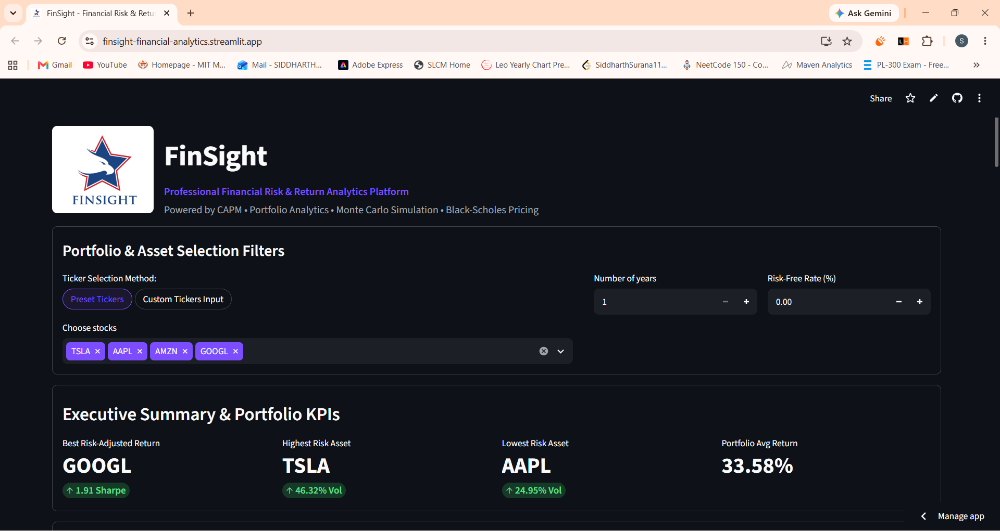
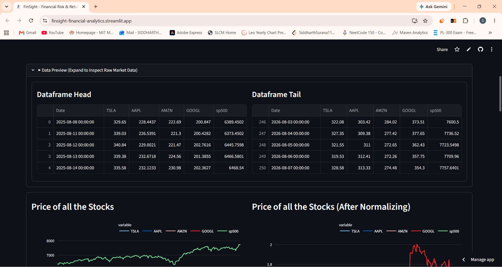
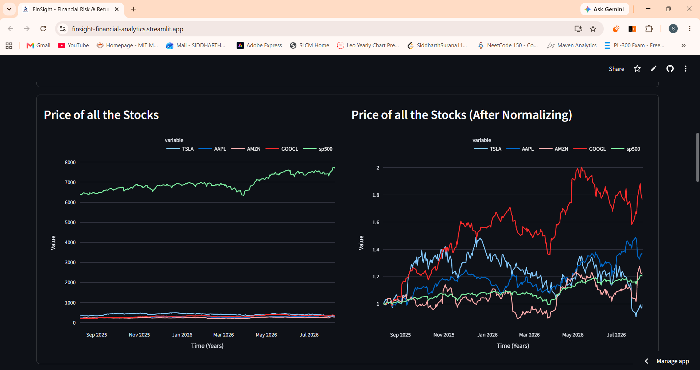
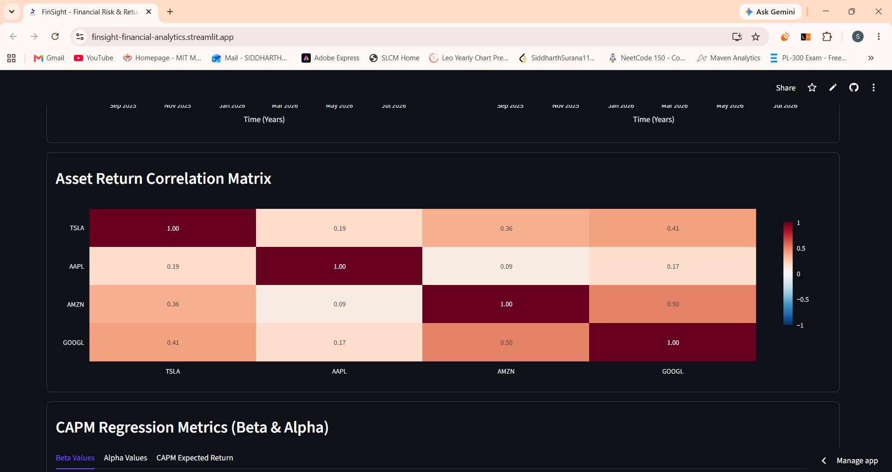
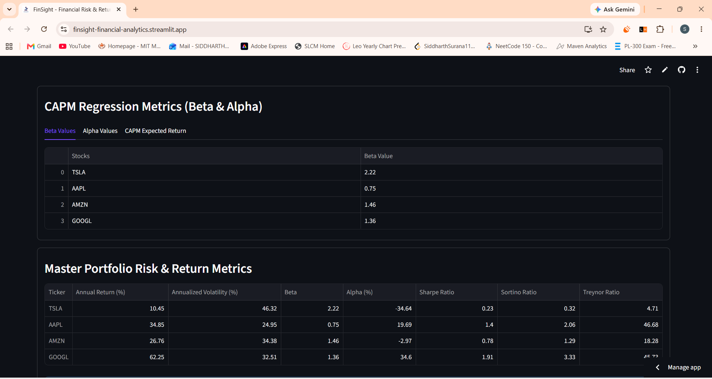
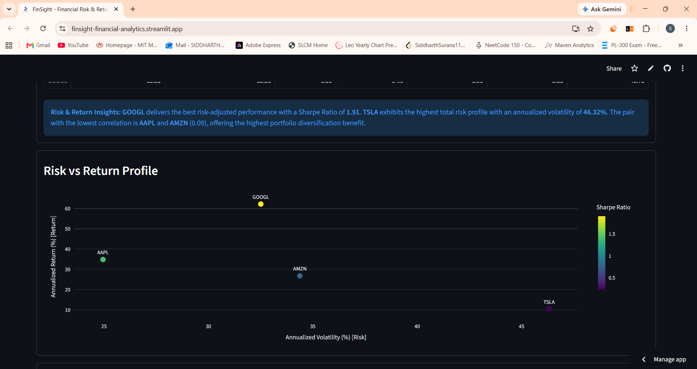
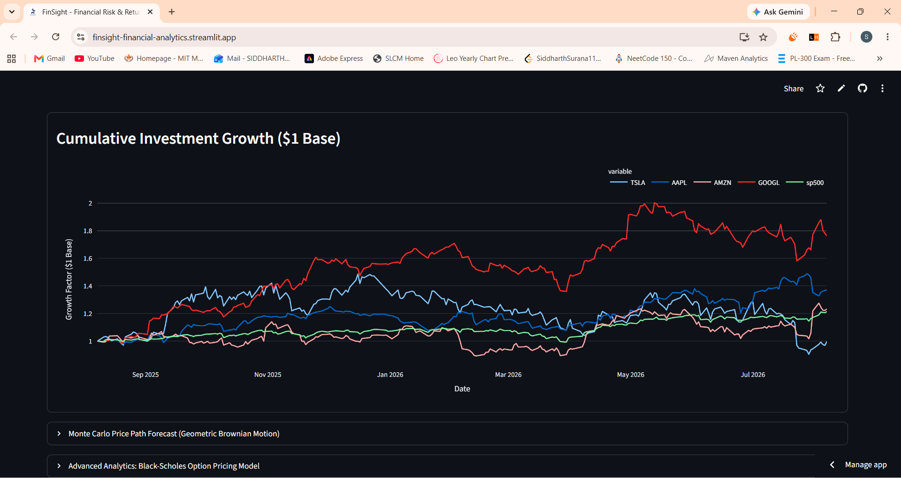
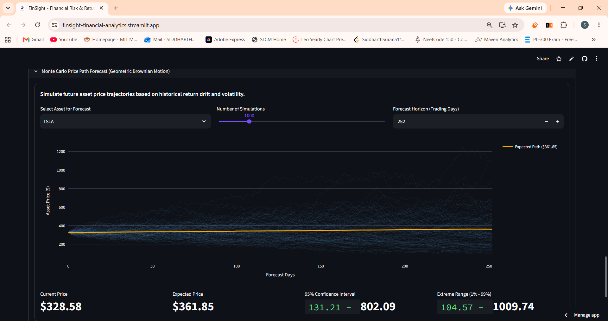
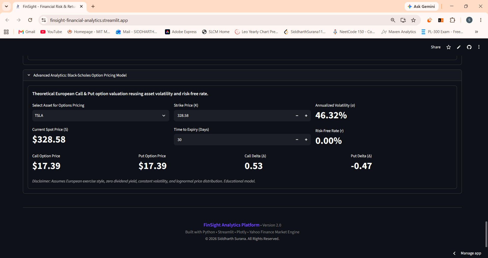

=# FinSight — Institutional Financial Risk & Return Analytics Platform

<p align="center">
  
</p>

<p align="center">
  <strong>An Institutional-Grade Quantitative Finance, CAPM Factor Modeling & Option Pricing Dashboard</strong>
</p>

<p align="center">
  
  
  
  
  
</p>

---

## 📌 Executive Overview

**FinSight (Version 2.0)** is an interactive quantitative finance platform designed for portfolio managers, equity research analysts, quantitative developers, and risk professionals. Upgraded from a foundational CAPM calculator into a unified analytics engine, FinSight provides a **single source of truth** for multi-asset risk-return metrics, regression risk factor modeling ($\beta$, $\alpha$), correlation dynamics, stochastic Monte Carlo price path forecasting, and Black-Scholes option pricing.

---

## 🎯 Business Problem & Product Vision

Traditional financial analytics tools and isolated Jupyter notebooks frequently present historical asset returns in isolation—omitting systematic market risk, downside asymmetry, cross-asset correlation structure, and forward-looking stochastic pricing probabilities.

**FinSight solves this gap by delivering:**

1. **Single-Source-of-Truth Analytics Pipeline**: Compute-once architectural pattern for annualized returns, volatility ($\sigma$), Sharpe, Sortino, and Treynor ratios without redundant processing.
2. **Automated Business Interpretation**: Programmatically derived natural-language commentary highlighting optimal risk-adjusted assets, highest risk profiles, and correlation diversification benefits.
3. **Advanced Quantitative Modules**: Forward-looking Monte Carlo price path forecasts via Geometric Brownian Motion (GBM) and analytical European option pricing via Black-Scholes with Delta sensitivities.
4. **Institutional Dashboard UX/UI**: Responsive dark-mode card layout, compact filter controls, and collapsible data inspection interfaces modeled after institutional financial terminals.

---

## ✨ Key Features & Capabilities

- 📈 **Real-Time Yahoo Finance Engine**: Dynamic market data acquisition for US Equities (e.g., `AAPL`, `MSFT`, `NVDA`, `TSLA`) and Indian NSE Equities (e.g., `INFY.NS`, `RELIANCE.NS`, `TCS.NS`) benchmarked against the S&P 500 (`^GSPC`).
- ⚡ **Single-Source-of-Truth Metrics**: Centralized calculation of daily returns, annualized risk ($\sigma \times \sqrt{252}$), compound annual returns, Sharpe Ratio, Sortino Ratio, and Treynor Ratio.
- 🧮 **CAPM Regression Risk Factors**: Covariance-based Beta ($\beta$) and Jensen's Alpha ($\alpha$) relative to market return benchmark.
- 🔗 **Pearson Correlation Dynamics**: Pairwise asset return correlation matrix to analyze portfolio diversification efficiency.
- 🎲 **Stochastic Monte Carlo Forecasting**: Geometric Brownian Motion (GBM) simulating up to 5,000 future price paths with expected price targets, 95% confidence intervals, and 1%–99% extreme risk bounds.
- 🔮 **Black-Scholes Option Pricing**: Analytical pricing of European Call and Put options alongside Call Delta ($\Delta_C$) and Put Delta ($\Delta_P$) risk sensitivities.
- 💡 **Programmatic Business Insights**: Automated narrative summaries rendering key takeaways on portfolio risk-return metrics and asset diversification.

---


## 📸 Dashboard Screenshots

FinSight provides an interactive institutional-style dashboard covering portfolio analytics, quantitative risk modeling, stochastic forecasting, and derivative pricing.

### 1. Dashboard Overview



### 2. Market Data Preview



### 3. Price & Normalized Price Analysis



### 4. Asset Return Correlation Matrix



### 5. CAPM Regression & Portfolio Risk Metrics



### 6. Risk vs Return Profile



### 7. Cumulative Investment Growth



### 8. Monte Carlo GBM Forecast



### 9. Black-Scholes Option Pricing



---

## 📐 Mathematical Foundations

### 1. Capital Asset Pricing Model (CAPM)
$$E(R_i) = R_f + \beta_i \cdot \big(E(R_m) - R_f\big)$$

Where:
- $E(R_i)$: Expected return of asset $i$
- $R_f$: Risk-free rate
- $E(R_m)$: Expected annual market return (S&P 500 benchmark)
- $\beta_i$: Systematic market risk coefficient

### 2. Systematic Risk Factors ($\beta$ and $\alpha$)
$$\beta_i = \frac{\text{Cov}(R_i, R_m)}{\text{Var}(R_m)}, \quad \alpha_i = \bar{R}_i - \beta_i \cdot \bar{R}_m$$

### 3. Risk-Adjusted Return Metrics
- **Sharpe Ratio**: $\frac{\bar{R}_i - R_f}{\sigma_i}$
- **Sortino Ratio**: $\frac{\bar{R}_i - R_f}{\sigma_{\text{downside}}}$, where $\sigma_{\text{downside}} = \sqrt{\text{mean}\big(\min(R_i, 0)^2\big)} \times \sqrt{252}$
- **Treynor Ratio**: $\frac{\bar{R}_i - R_f}{\beta_i}$

### 4. Monte Carlo Simulation (Geometric Brownian Motion)
$$S_t = S_0 \cdot \exp\left(\left(\mu - \frac{1}{2}\sigma^2\right)t + \sigma \sqrt{t} \, Z_t\right)$$

Where $Z_t \sim \mathcal{N}(0, 1)$ represents standard normal random draws.

### 5. Black-Scholes Options Pricing Model
$$C = S_0 N(d_1) - K e^{-rT} N(d_2), \quad P = K e^{-rT} N(-d_2) - S_0 N(-d_1)$$

$$d_1 = \frac{\ln(S_0/K) + \left(r + \frac{1}{2}\sigma^2\right)T}{\sigma\sqrt{T}}, \quad d_2 = d_1 - \sigma\sqrt{T}$$

---

## 🏗 System Architecture & Workflow

```
┌────────────────────────────────────────────────────────┐
│               FinSight Web Dashboard                   │
│        (Streamlit UI + Custom Dark Card Layout)        │
└───────────────────────────┬────────────────────────────┘
                            │
                            ▼
┌────────────────────────────────────────────────────────┐
│             Yahoo Finance Market Download              │
│       (@st.cache_data for S&P 500 + Asset Prices)      │
└───────────────────────────┬────────────────────────────┘
                            │
                            ▼
┌────────────────────────────────────────────────────────┐
│         financial_models.py Single Source of Truth      │
│          (Compute Once: Returns, Volatility,           │
│           Beta, Alpha, Sharpe, Sortino, Treynor)       │
└───────────────────────────┬────────────────────────────┘
                            │
             ┌──────────────┼──────────────┐
             ▼              ▼              ▼
     ┌──────────────┐┌──────────────┐┌──────────────┐
     │ Executive    ││ Interactive  ││ Stochastic   │
     │ KPI Row      ││ Plotly Charts││ Quantitative │
     │ Card         ││ & Heatmap    ││ Modules (MC) │
     └──────────────┘└──────────────┘└──────────────┘
```

---

## 💻 Installation & Quickstart

### Prerequisites
- Python 3.10+ (Tested on Python 3.10 – 3.13)
- `pip` package manager

### Setup Steps
1. **Clone the repository:**
   ```bash
   git clone https://github.com/SiddharthSurana11/FinSight.git
   cd FinSight
   ```

2. **Create and activate a virtual environment:**
   ```bash
   python -m venv .venv
   # Windows (PowerShell):
   .\.venv\Scripts\Activate.ps1
   # Linux/macOS:
   source .venv/bin/activate
   ```

3. **Install dependencies:**
   ```bash
   pip install -r requirements.txt
   ```

4. **Launch FinSight:**
   ```bash
   streamlit run app.py
   ```
   Access the interactive dashboard at `http://localhost:8501`.

---

## 📊 Repository Structure

```
FinSight/
├── .streamlit/
│   └── config.toml          # Streamlit custom dark theme configuration
├── assets/
│   └── logo/
│       └── finsight_logo.png # FinSight official brand asset
├── app.py                   # Entry point & analytics pipeline orchestration
├── content_renderer.py      # Streamlit UI components, cards, inputs, layout
├── financial_models.py      # Pure quantitative finance engine & Plotly chart builders
├── footer.py                # FinSight Version 2 professional footer
├── .gitignore               # Production Git ignore rules
├── requirements.txt         # Dependencies list
├── LICENSE                  # MIT License
└── README.md                # Project documentation & GitHub landing page
```

---

## 📜 License

Distributed under the MIT License. See [LICENSE](LICENSE) for details.

---

## 👨‍💻 Author

**Siddharth Surana**  
*Mathematics & Computing Engineering Student*  
Specializing in Quantitative Finance, Data Analytics & Software Engineering.
